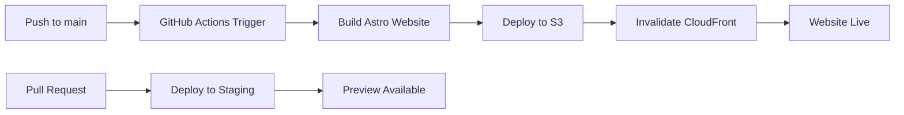
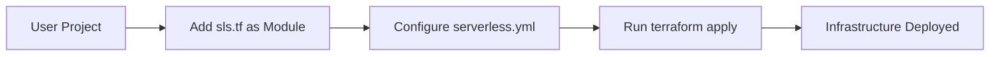

# sls.tf Website Deployment Guide

This document explains how the sls.tf documentation website is completely separate from the main Terraform module and how to deploy it.

## Architecture Overview

The sls.tf repository contains two completely separate components:

### 📦 **Main Terraform Module** (`/`)
- **Purpose**: Serverless Framework to Terraform conversion
- **Usage**: Deploy serverless applications
- **Dependencies**: Terraform, AWS Provider, Node.js (optional)
- **Location**: Root directory of repository

### 🌐 **Documentation Website** (`/website/`)
- **Purpose**: Static documentation website built with Astro
- **Usage**: Documentation and examples for sls.tf module
- **Dependencies**: Node.js, Astro, AWS S3, CloudFront
- **Deployment**: Automated via GitHub Actions
- **Location**: `/website/` directory

## Key Benefits of Separation

### ✅ **Complete Independence**
- Module can be used without any website components
- Website can be deployed independently
- No circular dependencies or shared resources
- Clear separation of concerns

### ✅ **Independent Lifecycles**
- Module versioning doesn't affect website
- Website updates don't impact module functionality
- Separate CI/CD pipelines
- Independent testing and deployment

### ✅ **Different Technology Stacks**
- Module: Terraform + HCL
- Website: Astro + TypeScript + Tailwind CSS
- Each uses appropriate tools for its purpose

### ✅ **Security Isolation**
- Website credentials separate from module credentials
- Different IAM roles and permissions
- Isolated AWS resources
- Reduced attack surface

## Project Structure

```
sls.tf/
├── 📦 Main Terraform Module
│   ├── main.tf                    # Module entry point
│   ├── variables.tf               # Module variables
│   ├── outputs.tf                 # Module outputs
│   ├── locals.tf                  # Local variables
│   ├── custom_resources.tf        # Custom resource handling
│   ├── variable_resolution.tf     # Variable resolution engine
│   ├── typescript-parser.tf       # TypeScript support
│   ├── examples/                  # Example configurations
│   ├── tests/                     # Module tests
│   └── scripts/                   # Utility scripts
│
├── 🌐 Documentation Website
│   ├── website/
│   │   ├── package.json           # Website dependencies
│   │   ├── astro.config.mjs       # Astro configuration
│   │   ├── tailwind.config.mjs    # Tailwind CSS config
│   │   ├── src/                   # Website source code
│   │   │   ├── content/docs/      # Documentation content
│   │   │   ├── layouts/           # Astro layouts
│   │   │   ├── components/        # Reusable components
│   │   │   └── styles/            # CSS and styling
│   │   └── dist/                  # Built website (generated)
│   └── infrastructure/website/    # Website infrastructure
│       ├── main.tf                # Website Terraform
│       ├── variables.tf           # Website variables
│       ├── outputs.tf             # Website outputs
│       └── security-headers.js   # CloudFront function
│
├── 🔄 CI/CD
│   └── .github/workflows/
│       ├── website-deploy.yml    # Website deployment pipeline
│       └── (other workflows)      # Module testing, etc.
│
└── 📚 Documentation
    ├── README.md                  # Main module documentation
    ├── README-WEBSITE.md         # This file
    ├── ELEMENTAL-TO-SERVERLESS-CONVERSION.md
    └── agent-os/                  # Product management
```

## Deployment Workflow

### 🌐 **Website Deployment** (Automatic)



### 📦 **Module Usage** (Manual/CI)



## Quick Start for Website

### 1. Prerequisites
- Node.js 20+
- AWS CLI configured
- Domain name (optional)

### 2. Build Locally
```bash
cd website
npm install
npm run build
npm run preview
```

### 3. Deploy Infrastructure
```bash
cd infrastructure/website
terraform init
terraform apply
```

### 4. Configure GitHub Actions
Add secrets to repository:
- `AWS_ACCESS_KEY_ID`
- `AWS_SECRET_ACCESS_KEY`
- `CLOUDFRONT_DISTRIBUTION_ID_PRODUCTION`
- `CLOUDFRONT_DISTRIBUTION_ID_STAGING`

### 5. Automatic Deployment
- Push to `main` → Production deployment
- Create PR → Staging deployment
- Manual trigger → Environment selection

## Independence Verification

### ✅ **Module Only Usage**
Users can use sls.tf without any website:
```hcl
module "my_service" {
  source = "github.com/your-org/sls.tf"
  config_path = "serverless.yml"
}
```

### ✅ **Website Only Development**
Website can be developed without module knowledge:
```bash
cd website
npm run dev  # Local development
```

### ✅ **Separate Testing**
- Module tests: `terraform test`
- Website tests: `npm run build` + link checking
- Independent CI/CD pipelines

### ✅ **Separate AWS Resources**
- Module: Creates user's serverless resources
- Website: Creates S3 + CloudFront for documentation
- No shared resources between them

## Configuration Examples

### Module Configuration
```hcl
# users/terraform/main.tf
module "serverless_app" {
  source       = "./modules/sls.tf"
  config_path  = "${path.module}/serverless.yml"

  # Module specific variables
  lambda_code_path = "${path.module}/src"
  aws_region = "us-west-2"
}
```

### Website Configuration
```hcl
# infrastructure/website/main.tf
resource "aws_s3_bucket" "website" {
  bucket = "sls.tf"
  # Website specific configuration
}

resource "aws_cloudfront_distribution" "website" {
  # CDN configuration for website only
}
```

### CI/CD Configuration
```yaml
# .github/workflows/website-deploy.yml
name: Deploy Website
on:
  push:
    branches: [main]
    paths: ['website/**']  # Only website changes
```

## Security Considerations

### ✅ **Isolated Credentials**
- Module users: Need permissions for their own resources
- Website deployment: Need permissions for S3/CloudFront only
- No credential sharing between components

### ✅ **Resource Isolation**
- Module: Creates resources in user's AWS account
- Website: Creates resources in documentation AWS account
- No cross-account resource access

### ✅ **Network Isolation**
- Module resources: VPC, security groups, etc.
- Website: Public CDN, S3 static hosting
- No network dependencies between them

## Cost Implications

### Module Costs
- User pays for their own serverless resources
- No additional costs for website infrastructure

### Website Costs
- ~$36/month for documentation hosting
- Separate from any module usage costs
- Paid by project maintainers

### Total Cost
- Module users: Only their infrastructure costs
- Project maintainers: Website hosting costs
- No cross-subsidization

## Maintenance

### Module Maintenance
- Update Terraform providers
- Add new Serverless Framework features
- Fix bugs and improve functionality
- Independent of website

### Website Maintenance
- Update documentation content
- Improve website design and UX
- Fix website build issues
- Independent of module

### Release Coordination
- Module releases don't require website updates
- Website updates don't affect module functionality
- Independent versioning and release cycles

## Troubleshooting

### Website Issues
```bash
# Build issues
cd website && npm run build

# Deployment issues
cd infrastructure/website && terraform plan

# CI/CD issues
# Check .github/workflows/website-deploy.yml
```

### Module Issues
```bash
# Module issues
terraform plan
terraform validate

# Configuration issues
# Check serverless.yml syntax
```

### Independence Issues
If you suspect cross-dependencies:
1. Check for shared variables
2. Verify AWS resource isolation
3. Review CI/CD workflow scopes
4. Test components separately

## Best Practices

### For Maintainers
1. **Keep Changes Isolated**: Module changes shouldn't affect website
2. **Separate Testing**: Test components independently
3. **Independent Releases**: Version components separately
4. **Clear Documentation**: Explain separation in docs

### For Users
1. **Module Usage**: Use sls.tf as any other Terraform module
2. **Website Access**: Visit sls.tf for documentation
3. **Support**: Report issues to appropriate component
4. **Contributions**: Contribute to relevant component

### For Developers
1. **Local Development**: Use appropriate local setup
2. **Testing**: Test changes in isolation
3. **Deployment**: Follow component-specific deployment流程
4. **Security**: Maintain credential separation

## Summary

The separation between the sls.tf module and website provides:

✅ **Clear boundaries** and separation of concerns
✅ **Independent development** and deployment
✅ **Resource isolation** and security
✅ **Cost transparency** and accountability
✅ **Flexible maintenance** and updates
✅ **Better user experience** for both components

This architecture ensures that the module can be used independently while maintaining a high-quality documentation website that serves as a complete resource for users.