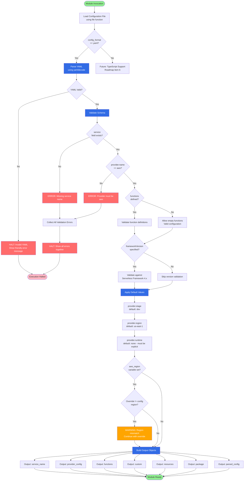

# Data Flow Diagram

This diagram illustrates how YAML configuration flows through parsing, validation, and output generation.

## Key Processing Steps

1. **File Loading**: Read configuration file from `config_path`
2. **Format Detection**: Check `config_format` variable (YAML only for now)
3. **YAML Parsing**: Use `yamldecode()` wrapped in `try()` for error handling
4. **Schema Validation**: Validate required fields (service, provider.name)
5. **Function Validation**: Allow empty functions list (functionless configs valid)
6. **Framework Version**: Validate `frameworkVersion` if specified
7. **Default Application**: Apply Serverless Framework defaults (stage, region)
8. **Region Override**: Compare `aws_region` variable with config, warn if different
9. **Output Generation**: Build all output objects for downstream modules
10. **Error Collection**: Gather ALL validation errors and display together
