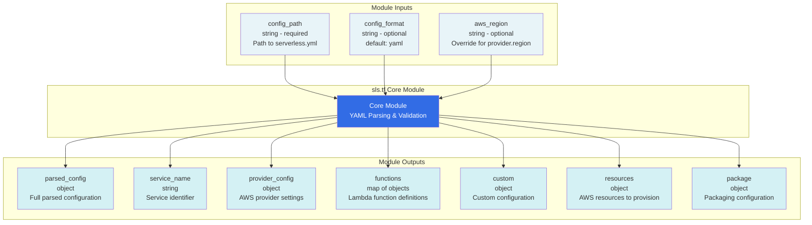

# Module Interface Diagram

This diagram shows the inputs and outputs of the sls.tf core module.

## Input Variables

| Variable | Type | Required | Default | Description |
|----------|------|----------|---------|-------------|
| `config_path` | string | yes | - | Path to serverless.yml or serverless.ts file |
| `config_format` | string | no | "yaml" | Configuration file format (yaml or typescript) |
| `aws_region` | string | no | null | Override AWS region (warns if different from config) |

## Output Values

| Output | Type | Description |
|--------|------|-------------|
| `parsed_config` | object | Complete parsed serverless configuration |
| `service_name` | string | Service name from configuration |
| `provider_config` | object | AWS provider configuration block |
| `functions` | map(object) | Map of Lambda function definitions |
| `custom` | object | Custom configuration section |
| `resources` | object | Additional AWS resources to create |
| `package` | object | Packaging configuration |
