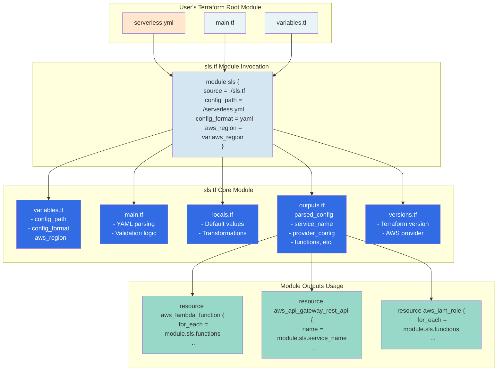

# Module Usage Example

This diagram shows how a user would consume the sls.tf core module in their Terraform configuration.



## Example Terraform Configuration

### User's `main.tf`

```hcl
# Invoke the sls.tf module
module "serverless" {
  source = "./sls.tf"

  config_path   = "${path.module}/serverless.yml"
  config_format = "yaml"
  aws_region    = var.aws_region  # Optional override
}

# Use module outputs to create AWS resources
# (Future roadmap items will handle this internally)
output "service_name" {
  value = module.serverless.service_name
}

output "parsed_configuration" {
  value = module.serverless.parsed_config
}
```

### User's `serverless.yml`

```yaml
service: my-serverless-app

provider:
  name: aws
  runtime: nodejs20.x
  stage: dev
  region: us-east-1
  memorySize: 1024
  timeout: 30

functions:
  hello:
    handler: handler.hello
    events:
      - http:
          path: hello
          method: get

  world:
    handler: handler.world
    memorySize: 512
    events:
      - http:
          path: world
          method: post

custom:
  myCustomValue: example

resources:
  Resources:
    MyBucket:
      Type: AWS::S3::Bucket
      Properties:
        BucketName: my-serverless-bucket
```

### Module Output Structure

```hcl
# module.serverless.service_name
"my-serverless-app"

# module.serverless.provider_config
{
  name       = "aws"
  runtime    = "nodejs20.x"
  stage      = "dev"
  region     = "us-east-1"
  memorySize = 1024
  timeout    = 30
}

# module.serverless.functions
{
  hello = {
    handler = "handler.hello"
    events = [
      {
        http = {
          path   = "hello"
          method = "get"
        }
      }
    ]
  }
  world = {
    handler    = "handler.world"
    memorySize = 512
    events = [
      {
        http = {
          path   = "world"
          method = "post"
        }
      }
    ]
  }
}
```

## Functionless Configuration Example

```yaml
# Valid serverless.yml without functions
service: infrastructure-only

provider:
  name: aws
  runtime: nodejs20.x
  region: us-east-1

resources:
  Resources:
    MyQueue:
      Type: AWS::SQS::Queue
      Properties:
        QueueName: my-queue

    MyTopic:
      Type: AWS::SNS::Topic
      Properties:
        TopicName: my-topic
```

This configuration is valid and demonstrates infrastructure-only deployments.
