# Validation Flow Diagram

This diagram shows the comprehensive validation logic with error collection and friendly error messages.

```mermaid
flowchart TD
    Start([Begin Validation]) --> InitErrors[Initialize Error Collection List]

    InitErrors --> V1{service<br/>field exists?}
    V1 -->|No| E1[Add Error:<br/>Required field 'service' is missing.<br/>Specify service name in serverless.yml]
    V1 -->|Yes| V2
    E1 --> V2

    V2{provider<br/>field exists?} -->|No| E2[Add Error:<br/>Required field 'provider' is missing.<br/>Must specify AWS provider configuration]
    V2 -->|Yes| V3
    E2 --> V3

    V3{provider.name<br/>== aws?} -->|No| E3[Add Error:<br/>Invalid provider.name value.<br/>Must be 'aws', got: provider.name]
    V3 -->|Yes| V4
    E3 --> V4

    V4{provider.runtime<br/>specified?} -->|No| W1[Add Warning:<br/>No runtime specified.<br/>Functions must define runtime individually]
    V4 -->|Yes| CheckRuntime
    W1 --> V5

    CheckRuntime{Runtime<br/>valid?} -->|No| E4[Add Error:<br/>Invalid runtime value.<br/>Must match pattern: nodejsX.x, pythonX.x, etc.]
    CheckRuntime -->|Yes| V5
    E4 --> V5

    V5{functions<br/>field exists?} -->|No| AllowEmpty[No Error:<br/>Functionless config is valid]
    V5 -->|Yes| ValidateFunctions
    AllowEmpty --> V6

    ValidateFunctions --> CheckEach[For each function definition]
    CheckEach --> VF1{handler<br/>specified?}
    VF1 -->|No| EF1[Add Error:<br/>Function 'name' missing required field 'handler']
    VF1 -->|Yes| VF2
    EF1 --> VF2

    VF2{runtime valid<br/>if specified?} -->|No| EF2[Add Error:<br/>Function 'name' has invalid runtime]
    VF2 -->|Yes| VF3
    EF2 --> VF3

    VF3{memory valid<br/>if specified?} -->|No| EF3[Add Error:<br/>Function 'name' memorySize must be 128-10240 MB]
    VF3 -->|Yes| VF4
    EF3 --> VF4

    VF4{timeout valid<br/>if specified?} -->|No| EF4[Add Error:<br/>Function 'name' timeout must be 1-900 seconds]
    VF4 -->|Yes| NextFunc
    EF4 --> NextFunc

    NextFunc{More<br/>functions?} -->|Yes| CheckEach
    NextFunc -->|No| V6

    V6{frameworkVersion<br/>specified?} -->|No| SkipFW[Skip framework version validation]
    V6 -->|Yes| ValidateFW
    SkipFW --> V7

    ValidateFW{Version<br/>compatible?} -->|No| E5[Add Error:<br/>frameworkVersion 'X' not compatible.<br/>Supported: 2.x, 3.x, 4.x]
    ValidateFW -->|Yes| V7
    E5 --> V7

    V7{aws_region<br/>override set?} -->|No| CheckErrors
    V7 -->|Yes| CompareRegions

    CompareRegions{Override !=<br/>config region?} -->|No| CheckErrors
    CompareRegions -->|Yes| WR1[Add Warning:<br/>Region override 'X' differs from<br/>serverless.yml region 'Y'.<br/>Using override value.]
    WR1 --> CheckErrors

    CheckErrors{Error list<br/>empty?} -->|No| DisplayErrors[Display ALL Errors Together]
    CheckErrors -->|Yes| CheckWarnings

    DisplayErrors --> Halt([HALT Execution])

    CheckWarnings{Warning list<br/>empty?} -->|No| DisplayWarnings[Display All Warnings<br/>Continue execution]
    CheckWarnings -->|Yes| Success
    DisplayWarnings --> Success

    Success([Validation Successful<br/>Proceed to Output Generation])

    style Start fill:#90EE90
    style Success fill:#90EE90
    style Halt fill:#FF6B6B,color:#fff
    style E1 fill:#FFB6C1
    style E2 fill:#FFB6C1
    style E3 fill:#FFB6C1
    style E4 fill:#FFB6C1
    style E5 fill:#FFB6C1
    style EF1 fill:#FFB6C1
    style EF2 fill:#FFB6C1
    style EF3 fill:#FFB6C1
    style EF4 fill:#FFB6C1
    style W1 fill:#FFE6B3
    style WR1 fill:#FFE6B3
    style AllowEmpty fill:#D4F1F4
    style DisplayErrors fill:#FF6B6B,color:#fff
    style DisplayWarnings fill:#FFA500,color:#fff
    style CheckErrors fill:#326CE5,color:#fff
    style CheckWarnings fill:#326CE5,color:#fff
```



## Validation Rules Summary

### Required Field Validations

| Field | Requirement | Error Message |
|-------|-------------|---------------|
| `service` | Must be present, non-empty string | "Required field 'service' is missing. Specify service name in serverless.yml" |
| `provider` | Must be present, object type | "Required field 'provider' is missing. Must specify AWS provider configuration" |
| `provider.name` | Must equal "aws" | "Invalid provider.name value. Must be 'aws', got: {value}" |

### Optional Field Validations

| Field | Validation | Error/Warning |
|-------|------------|---------------|
| `provider.runtime` | Match pattern (nodejs*, python*, etc.) | ERROR if invalid format |
| `provider.region` | Valid AWS region code | WARNING if aws_region override differs |
| `provider.stage` | Any string | Default: "dev" |
| `provider.memorySize` | 128-10240 MB | ERROR if out of range |
| `provider.timeout` | 1-900 seconds | ERROR if out of range |
| `frameworkVersion` | 2.x, 3.x, or 4.x | ERROR if incompatible |
| `functions` | Optional, can be empty or absent | No error for missing |
| `functions[*].handler` | Required if function defined | ERROR if missing |
| `functions[*].runtime` | Valid runtime pattern | ERROR if invalid |
| `functions[*].memorySize` | 128-10240 MB | ERROR if out of range |
| `functions[*].timeout` | 1-900 seconds | ERROR if out of range |

### Default Values Applied

```hcl
# These defaults are applied after validation passes
provider.stage      = coalesce(provider.stage, "dev")
provider.region     = coalesce(provider.region, "us-east-1")
provider.memorySize = coalesce(provider.memorySize, 1024)
provider.timeout    = coalesce(provider.timeout, 6)

# Function-level defaults inherit from provider
functions[*].runtime    = coalesce(functions[*].runtime, provider.runtime)
functions[*].memorySize = coalesce(functions[*].memorySize, provider.memorySize)
functions[*].timeout    = coalesce(functions[*].timeout, provider.timeout)
```

## Error Collection Strategy

The validation system collects ALL errors before halting execution:

```hcl
# Pseudo-code for error collection
locals {
  validation_errors = concat(
    var.parsed_config.service == null ? ["Required field 'service' is missing"] : [],
    var.parsed_config.provider == null ? ["Required field 'provider' is missing"] : [],
    var.parsed_config.provider.name != "aws" ? ["Provider must be 'aws'"] : [],
    # ... all other validations
  )

  has_errors = length(local.validation_errors) > 0
}

# Use Terraform validation blocks to enforce
variable "validate_config" {
  type    = bool
  default = true

  validation {
    condition     = !local.has_errors
    error_message = "Configuration validation failed:\n${join("\n", local.validation_errors)}"
  }
}
```

This ensures developers see all issues at once, not one error per run.
