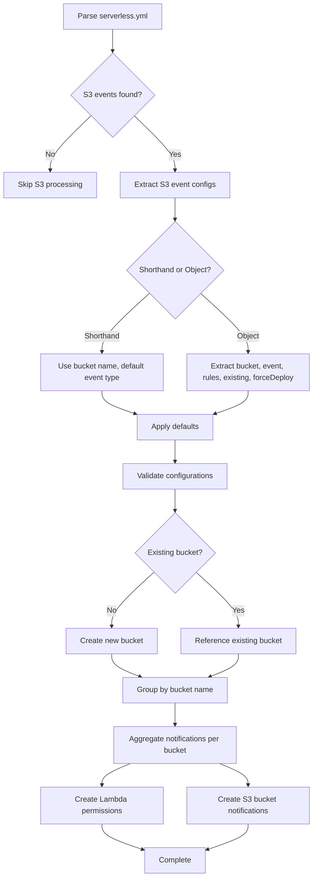
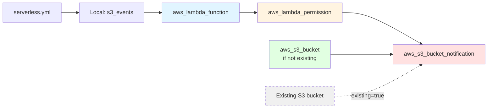
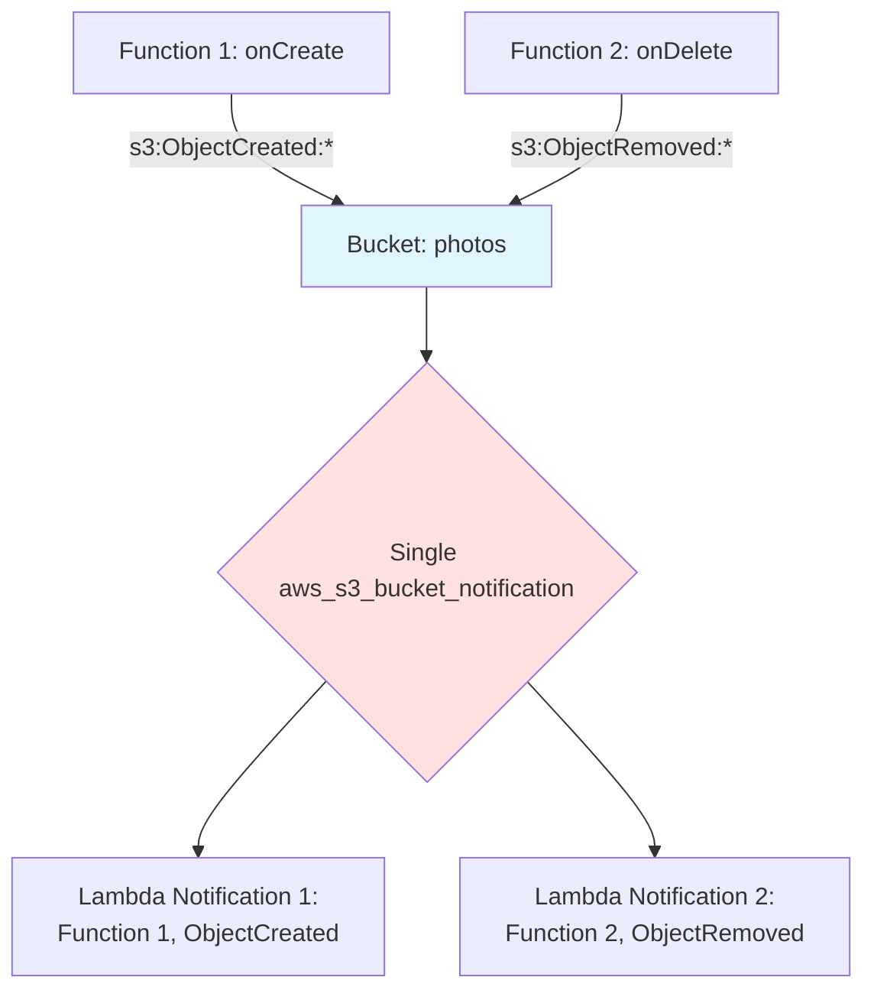
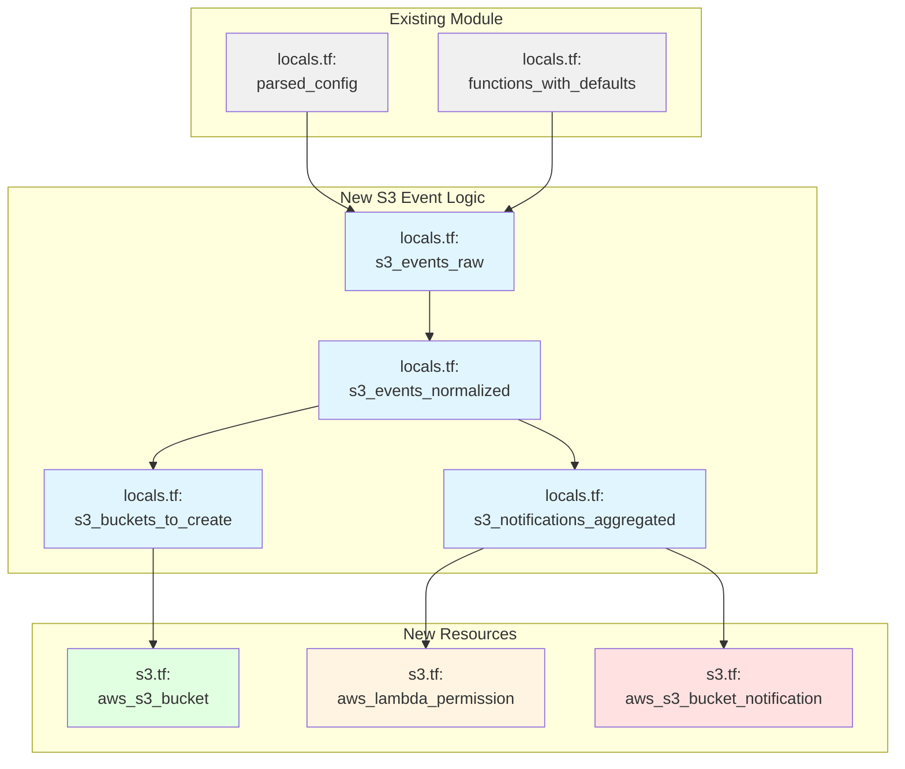

# Spec Requirements: S3 Event Source Mapping

## Initial Description
S3 Event Source Mapping - Provision S3 bucket notification configurations (aws_s3_bucket_notification) from Serverless s3 events with event type filtering, prefix/suffix patterns, and Lambda permission grants

## Requirements Discussion

### User Direction
**Instruction:** Mirror Serverless Framework behavior exactly. General assumptions are fine.

## Serverless Framework S3 Events Research

### Syntax Support

The Serverless Framework supports two syntax formats for S3 events:

**1. Shorthand String Syntax (creates new bucket):**
```yaml
functions:
  resize:
    handler: resize.handler
    events:
      - s3: photos
```
- Creates a new bucket with the specified name
- Triggers on any object creation/modification (default event type)
- Limitation: Bucket names must be globally unique in S3; hardcoded names prevent redeployment
- Recommendation from SLS: Use Serverless variables to add dynamic elements

**2. Full Object Syntax (configurable):**
```yaml
functions:
  users:
    handler: users.handler
    events:
      - s3:
          bucket: photos
          event: s3:ObjectRemoved:*
          rules:
            - prefix: uploads/
            - suffix: .jpg
          existing: true
          forceDeploy: true
```

### Configuration Properties

**bucket (required):**
- String value specifying bucket name
- Can reference new bucket or existing bucket (with `existing: true`)

**event (optional):**
- Default: `s3:ObjectCreated:*` (if not specified)
- Supports all AWS S3 notification event types:
  - `s3:ObjectCreated:*` - Any object creation
  - `s3:ObjectCreated:Put` - Object created via PUT
  - `s3:ObjectCreated:Post` - Object created via POST
  - `s3:ObjectCreated:Copy` - Object created via COPY
  - `s3:ObjectCreated:CompleteMultipartUpload` - Multipart upload completed
  - `s3:ObjectRemoved:*` - Any object deletion
  - `s3:ObjectRemoved:Delete` - Object deleted
  - `s3:ObjectRemoved:DeleteMarkerCreated` - Delete marker created
  - `s3:ObjectRestore:*` - Object restoration from Glacier
  - `s3:ObjectRestore:Post` - Restoration initiated
  - `s3:ObjectRestore:Completed` - Restoration completed
  - `s3:ReducedRedundancyLostObject` - RRS object lost
  - `s3:Replication:*` - Replication events

**rules (optional):**
- Array of filter rules to restrict when function executes
- Each rule can have:
  - `prefix: "string"` - Object key prefix filter
  - `suffix: "string"` - Object key suffix filter
- Multiple rules create AND conditions (e.g., prefix AND suffix)
- Example: Only trigger for `.jpg` files in `uploads/` folder

**existing (optional):**
- Boolean flag (default: false)
- When `true`: Attaches to pre-existing bucket instead of creating new one
- Requires framework version 1.47.0 or later
- Constraint: Only 1 existing bucket per function allowed
- Adds additional Lambda function and IAM role for custom resource management

**forceDeploy (optional):**
- Boolean flag (default: false)
- Only valid when used with `existing: true`
- Forces CloudFormation to update trigger configurations even if no changes detected
- Useful for updating existing bucket notification configurations

### Custom Bucket Properties

Buckets can be configured with additional properties via provider section:

```yaml
functions:
  resize:
    handler: resize.handler
    events:
      - s3: bucketOne

provider:
  s3:
    bucketOne:
      name: my-custom-bucket-name
      versioningConfiguration:
        Status: Enabled
      # Other CloudFormation S3 bucket properties
```

- Properties use camelCase format (CloudFormation style)
- All AWS CloudFormation S3 bucket properties supported
- If no explicit name provided, the key (e.g., "bucketOne") is used as bucket name
- Must follow S3 naming conventions

### Multiple Functions on Same Bucket

Multiple functions can subscribe to the same bucket with different event configurations:

```yaml
functions:
  onCreate:
    handler: onCreate.handler
    events:
      - s3:
          bucket: photos
          event: s3:ObjectCreated:*
  onDelete:
    handler: onDelete.handler
    events:
      - s3:
          bucket: photos
          event: s3:ObjectRemoved:*
```

**Important Constraint:** "You can't repeat the same configuration in both functions" - Each function must have a distinct event type or filter combination.

### Validation Rules & Constraints

1. **Bucket Name Uniqueness:** Bucket names must be globally unique in S3
2. **Distinct Event Configurations:** Same bucket can trigger multiple functions, but each must have unique event type or filter rules
3. **Existing Bucket Limit:** Only 1 existing bucket attachment per function
4. **Framework Version:** `existing: true` requires Serverless Framework 1.47.0+
5. **forceDeploy Dependency:** `forceDeploy` must be used with `existing: true`
6. **S3 Naming Conventions:** Bucket names must follow AWS S3 naming rules (lowercase, no underscores, etc.)

### Edge Cases & Behaviors

**1. Bucket Creation vs. Attachment:**
- Without `existing: true`: Framework creates new bucket (fails if bucket already exists)
- With `existing: true`: Framework attaches to existing bucket (fails if bucket doesn't exist)

**2. Notification Configuration Aggregation:**
- When multiple functions reference the same bucket, framework must aggregate all notifications into single `aws_s3_bucket_notification` resource
- Cannot create multiple notification resources for same bucket (AWS limitation)

**3. Lambda Permission Requirements:**
- Framework automatically creates `aws_lambda_permission` resource to allow S3 to invoke Lambda
- Permission includes source ARN of the bucket
- Required for both new and existing buckets

**4. Custom Resource for Existing Buckets:**
- Existing bucket integration requires custom CloudFormation resource
- Additional Lambda function created to manage notification configuration
- Additional IAM role created for custom resource Lambda

**5. Default Event Type:**
- If `event` not specified, defaults to `s3:ObjectCreated:*`
- This is implicit in shorthand syntax: `- s3: bucketname`

**6. Filter Rule Behavior:**
- No rules: Function triggers on all objects
- Prefix only: Triggers for objects with matching prefix
- Suffix only: Triggers for objects with matching suffix
- Both prefix and suffix: Triggers only when BOTH conditions met (AND logic)

## Existing Code to Reference

### Similar Features in Codebase

**Core Module Structure (Completed):**
- Path: `/home/tom/p/t/sls.tf/`
- Files: `main.tf`, `locals.tf`, `variables.tf`
- Patterns to reference:
  - YAML parsing with `yamldecode()` in `locals.tf`
  - Validation error collection pattern using `concat()` and conditional lists
  - Default value application using `coalesce()` and `merge()`
  - Precondition validation in `main.tf` with `null_resource`
  - Region override warning pattern

**Lambda Function Translation (Spec Available):**
- Spec: `/home/tom/p/t/sls.tf/agent-os/specs/2025-10-26-lambda-function-translation/spec.md`
- Patterns to reference:
  - Function-level configuration parsing
  - Default inheritance from provider settings
  - Resource generation from parsed configuration

**IAM Role & Policy Management (Spec Available):**
- Spec: `/home/tom/p/t/sls.tf/agent-os/specs/2025-10-26-iam-role-policy-management/spec.md`
- Patterns to reference:
  - IAM permission creation for AWS service integrations
  - Policy document generation

## Visual Assets

### Files Provided:
No visual assets provided.

### Mermaid Diagrams to Generate

The following diagrams should be created during specification writing to document the S3 event source mapping implementation:

**1. S3 Event Configuration Flow:**


**2. Resource Dependency Graph:**


**3. Notification Aggregation Pattern:**


**4. Integration with Module Structure:**


## Requirements Summary

### Functional Requirements

**Core S3 Event Processing:**
- Parse S3 event configurations from `functions.*.events` array where event type is `s3`
- Support both shorthand string syntax (`- s3: bucketname`) and full object syntax
- Extract bucket name, event type, filter rules, existing flag, and forceDeploy flag
- Apply default event type (`s3:ObjectCreated:*`) when not specified
- Normalize both syntax formats into consistent internal representation

**Bucket Management:**
- Create new S3 buckets for non-existing bucket references
- Support custom bucket properties from `provider.s3` section
- Reference existing buckets when `existing: true` flag is set
- Apply S3 naming convention validations
- Handle bucket name from either explicit `name` property or bucket key

**Lambda Permission Creation:**
- Generate `aws_lambda_permission` resources for each S3 event subscription
- Set principal to `s3.amazonaws.com`
- Include source ARN of the S3 bucket
- Ensure unique permission resource names per function-bucket-event combination

**Notification Configuration:**
- Aggregate all S3 event subscriptions per bucket into single `aws_s3_bucket_notification` resource
- Create `lambda_function` blocks within notification for each function subscription
- Include event types, filter rules (prefix/suffix), and Lambda function ARN
- Ensure one notification resource per bucket (AWS constraint)

**Filter Rule Support:**
- Parse `rules` array from S3 event configuration
- Support `prefix` and `suffix` filter properties
- Generate CloudFormation-compatible filter rule structure
- Handle empty rules (no filters)

**Custom Bucket Properties:**
- Parse `provider.s3.<bucket_key>` section for bucket configuration
- Support CloudFormation S3 bucket properties in camelCase format
- Apply custom properties to created buckets
- Use bucket key as default bucket name if `name` not specified

### Validation Requirements

**Configuration Validation:**
- Bucket name must be specified (required)
- Event type must be valid S3 notification event type (if specified)
- `forceDeploy` can only be used with `existing: true`
- Bucket names must follow S3 naming conventions (lowercase, no underscores, etc.)
- Duplicate event configurations on same bucket not allowed (must be distinct)

**Edge Case Validation:**
- Warn if bucket name is hardcoded (should use variables for uniqueness)
- Validate that existing buckets are not being created
- Validate that non-existing buckets are not referenced with `existing: true`
- Ensure multiple functions on same bucket have unique event configurations

**Error Messages:**
- Clear error when bucket name missing
- Clear error when invalid event type specified
- Clear error when `forceDeploy` used without `existing: true`
- Clear error when bucket name violates S3 naming rules
- Clear error when duplicate event configurations detected

### Reusability Opportunities

**Patterns from Core Module:**
- Validation error collection pattern (`concat()` with conditional lists)
- Default application pattern (`coalesce()`, `merge()`)
- Precondition validation with `null_resource`
- Warning display without blocking execution

**Patterns from Lambda Translation:**
- Function configuration extraction and normalization
- Default value inheritance from provider settings
- Resource generation from parsed configuration maps

**Patterns from IAM Management:**
- Permission resource creation for AWS service integrations
- Resource naming conventions
- ARN construction for AWS services

### Scope Boundaries

**In Scope:**
- Parse S3 events from serverless.yml functions
- Create S3 buckets for new bucket references
- Reference existing S3 buckets with `existing: true`
- Generate Lambda permissions for S3 invocation
- Create bucket notification configurations
- Support event type filtering
- Support prefix/suffix filter rules
- Aggregate multiple function subscriptions per bucket
- Apply custom bucket properties from provider.s3 section
- Validate S3 event configurations
- Support forceDeploy flag for existing buckets

**Out of Scope:**
- TypeScript configuration support (serverless.ts) - Future roadmap item #6
- Variable resolution for bucket names (e.g., `${self:service}`) - Future roadmap item #10
- Custom resource creation for existing bucket management (may require CloudFormation-style custom resources)
- S3 bucket lifecycle policies, replication, or other advanced bucket features (unless specified in provider.s3 section)
- Automatic bucket deletion on stack destroy (follow Terraform's default bucket retention behavior)
- S3 bucket policy management (separate feature, not part of event source mapping)

### Technical Considerations

**Integration Points:**
- Depends on Lambda function resources being created first (function ARN required)
- Depends on core module YAML parsing (`local.parsed_config`)
- Depends on function defaults application (`local.functions_with_defaults`)
- May interact with IAM role management for existing bucket custom resources

**Terraform Resource Structure:**
- New file: `s3.tf` for S3-related resources
- Resources: `aws_s3_bucket`, `aws_lambda_permission`, `aws_s3_bucket_notification`
- Locals: S3 event parsing, normalization, aggregation logic in `locals.tf`

**AWS Constraints:**
- One `aws_s3_bucket_notification` resource per bucket (must aggregate)
- S3 bucket names must be globally unique
- Lambda permissions required for S3 to invoke Lambda
- Existing bucket notifications may conflict with external management

**Notification Aggregation Strategy:**
- Group all S3 events by bucket name
- Create single notification resource per bucket
- Generate multiple `lambda_function` blocks within notification
- Ensure each function-event-filter combination is unique

**Existing Bucket Handling:**
- With `existing: true`: Use data source or direct reference
- Without `existing: true`: Create bucket with `aws_s3_bucket`
- Consider conflict scenarios where bucket exists but not marked as existing
- Handle forceDeploy flag to trigger notification updates

**Module Pattern Alignment:**
- Follow existing local variable organization in `locals.tf`
- Use `for_each` for resource generation
- Apply precondition validations in resource lifecycle blocks
- Expose relevant outputs (bucket ARNs, notification IDs)
