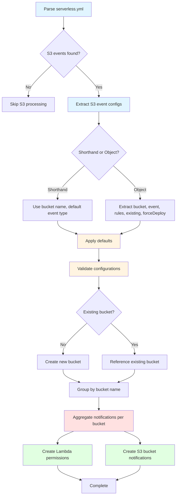

# S3 Event Configuration Flow

This diagram shows how S3 event configurations are parsed, normalized, validated, and transformed into AWS resources.

## Flow Stages

**1. Parsing (Blue):**
- Read serverless.yml configuration
- Extract S3 event definitions from function events

**2. Normalization (Yellow):**
- Distinguish between shorthand and object syntax
- Apply default values (event type, etc.)
- Validate configurations

**3. Aggregation (Red):**
- Group events by bucket name
- Merge multiple function subscriptions into single notification resource

**4. Resource Creation (Green):**
- Generate Lambda permissions for S3 invocation
- Create S3 bucket notification configurations
- Create new buckets or reference existing ones
