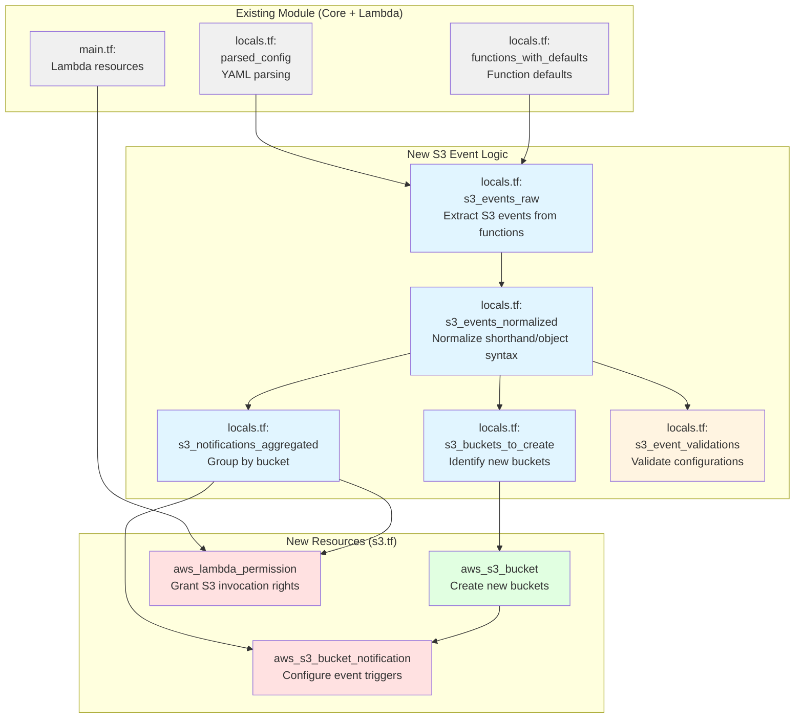

# Integration with Existing Module Structure

This diagram shows how S3 event source mapping integrates with the existing sls.tf module architecture.

## Integration Points

**Existing Module Components (Gray):**
- `parsed_config`: Core YAML parsing logic
- `functions_with_defaults`: Function configuration with defaults applied
- `main.tf`: Lambda function resources

**New Local Variables (Light Blue):**
- `s3_events_raw`: Initial extraction of S3 events from function definitions
- `s3_events_normalized`: Converted to consistent format (both shorthand and object syntax)
- `s3_buckets_to_create`: List of buckets that need to be created (not existing)
- `s3_notifications_aggregated`: Events grouped by bucket for aggregation

**Validations (Yellow):**
- `s3_event_validations`: Validation errors for S3 configurations
- Integrated into existing validation error collection pattern

**New Resources (Green/Red):**
- `aws_s3_bucket`: Creates new S3 buckets
- `aws_lambda_permission`: Grants S3 permission to invoke Lambda
- `aws_s3_bucket_notification`: Configures event notifications

## File Organization

**locals.tf:**
- Add S3 event parsing logic
- Add normalization transformations
- Add aggregation logic
- Extend validation_errors with S3 validations

**s3.tf (new file):**
- S3 bucket resources
- Lambda permission resources
- S3 bucket notification resources

**outputs.tf:**
- Expose S3 bucket ARNs
- Expose S3 bucket names
- Expose notification configuration IDs

## Data Flow

1. Core module parses serverless.yml → `parsed_config`
2. Lambda module applies function defaults → `functions_with_defaults`
3. S3 module extracts S3 events → `s3_events_raw`
4. S3 module normalizes syntax → `s3_events_normalized`
5. S3 module validates → `s3_event_validations`
6. S3 module identifies buckets → `s3_buckets_to_create`
7. S3 module aggregates notifications → `s3_notifications_aggregated`
8. Resources created in dependency order
