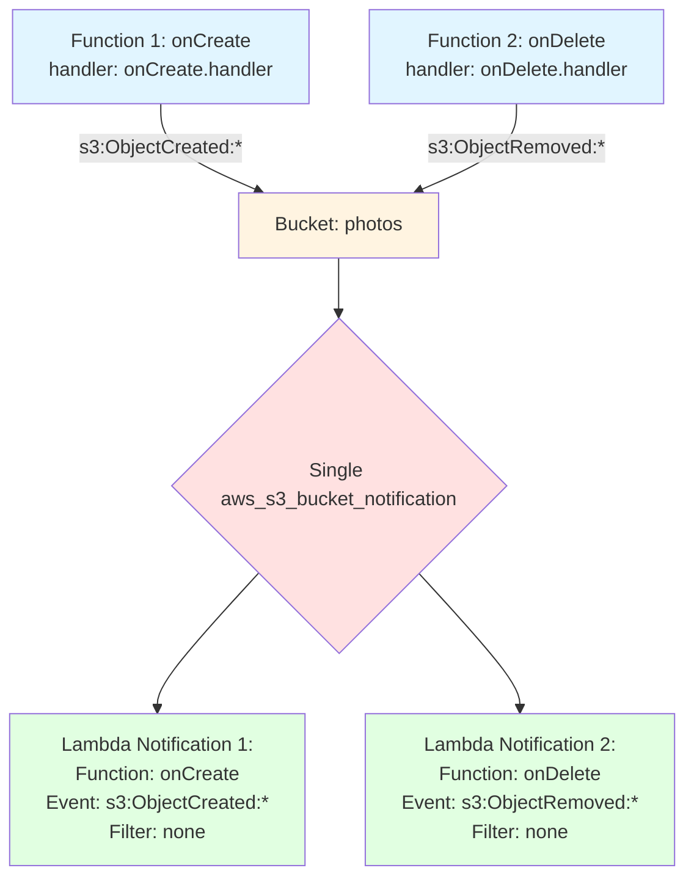

# Notification Aggregation Pattern

This diagram demonstrates how multiple functions subscribing to the same S3 bucket are aggregated into a single notification resource.



## Aggregation Rules

**AWS Constraint:**
- Only ONE `aws_s3_bucket_notification` resource allowed per bucket
- Multiple notifications must be combined into single resource

**Aggregation Process:**
1. Group all S3 events by bucket name
2. Create single notification resource per bucket
3. Add multiple `lambda_function` blocks to notification
4. Each block represents one function subscription

**Uniqueness Requirement:**
- Each function must have unique event configuration on same bucket
- Cannot have two functions with identical event type and filter rules
- Different event types allowed (e.g., ObjectCreated vs ObjectRemoved)
- Same event type with different filters allowed (e.g., different prefixes)

## Example Terraform Output

```hcl
resource "aws_s3_bucket_notification" "photos" {
  bucket = aws_s3_bucket.photos.id

  lambda_function {
    lambda_function_arn = aws_lambda_function.onCreate.arn
    events              = ["s3:ObjectCreated:*"]
  }

  lambda_function {
    lambda_function_arn = aws_lambda_function.onDelete.arn
    events              = ["s3:ObjectRemoved:*"]
  }

  depends_on = [
    aws_lambda_permission.onCreate_photos,
    aws_lambda_permission.onDelete_photos
  ]
}
```
