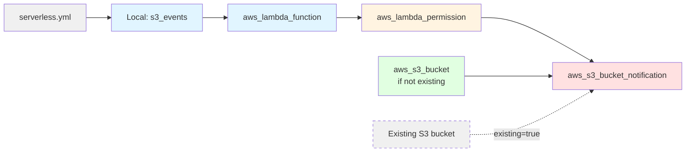

# Resource Dependency Graph

This diagram illustrates the dependencies between Terraform resources created for S3 event source mapping.

## Resource Relationships

**Configuration (Gray):**
- `serverless.yml`: Source configuration file
- `Existing S3 bucket`: Pre-existing bucket referenced with `existing: true`

**Locals (Light Blue):**
- `s3_events`: Parsed and normalized S3 event configurations
- `aws_lambda_function`: Lambda functions that handle S3 events (created by Lambda translation feature)

**Permissions (Yellow):**
- `aws_lambda_permission`: Grants S3 permission to invoke Lambda function
- Depends on: Lambda function
- Required by: S3 bucket notification

**Notifications (Red):**
- `aws_s3_bucket_notification`: Configures S3 bucket to send events to Lambda
- Depends on: Lambda permission, S3 bucket
- One notification resource per bucket (aggregates multiple functions)

**Buckets (Green):**
- `aws_s3_bucket`: New S3 bucket created by module
- Only created when `existing: false` (default)
- Required by: S3 bucket notification

## Dependency Order

1. Lambda functions must exist (from Lambda translation feature)
2. Lambda permissions must be created
3. S3 buckets must be created or referenced
4. S3 bucket notifications can be configured
